

  

<h1 align="center">GoupixDex</h1>

  <strong>The Pokémon TCG seller's workshop — from a card photo to a sold listing.</strong>

  Scan your cards, price them with Cardmarket data, publish them on Vinted, eBay and Leboncoin, 
  then keep stock, margins and the value of your collection in sync — in one web and desktop app.

  <a href="https://goupixdex.dibodev.fr/"><strong>Live app</strong></a> ·
  <a href="https://goupixdex.dibodev.fr/downloads">Desktop app (Windows / macOS)</a> ·
  <a href="web/README.md">Web README</a> ·
  <a href="api/README.md">API README</a>

  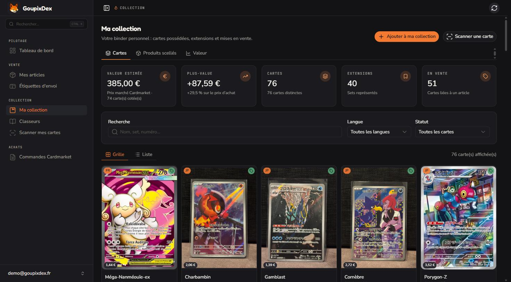

## Why GoupixDex?

Selling Pokémon cards one at a time is mostly busywork: identify the card, look up its price on Cardmarket, take photos, write a listing, publish it on each marketplace, then remember what sold where and at which margin. GoupixDex chains the whole flow:

1. **Scan** a card with your phone — set, number and language are recognised on-device.
2. **Price** it from the Cardmarket price guide (TCGPlayer and eBay as extra references), with your own margin on top.
3. **Publish** a prefilled listing on Vinted, eBay France or Leboncoin — no copy-paste between tools.
4. **Track** sales, profit, stock and the value of your collection over time.

Access is free and granted on request from [goupixdex.dibodev.fr/request](https://goupixdex.dibodev.fr/request). The interface is in French.

## Tour

> Screenshots taken from the production app. Personal data (e-mails, seller names, order numbers) is masked.

### Dashboard

Profit, revenue and number of sales over any period, the stock currently for sale (purchase cost, listed prices, estimated profit) and the Vinted vs eBay split. A second tab follows the collection: estimated value, best investments and most valuable cards.

<table>
  <tr>
    <td width="50%">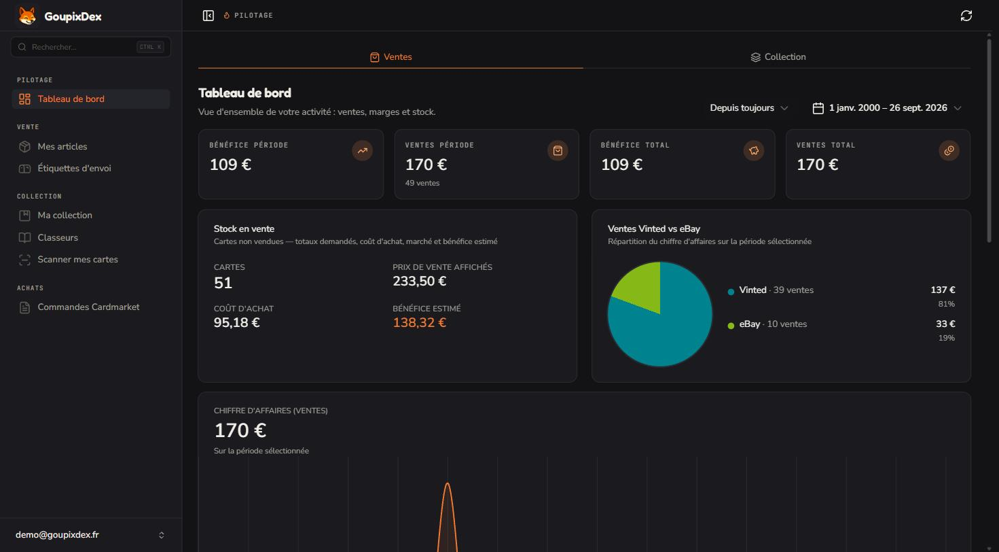</td>
    <td width="50%">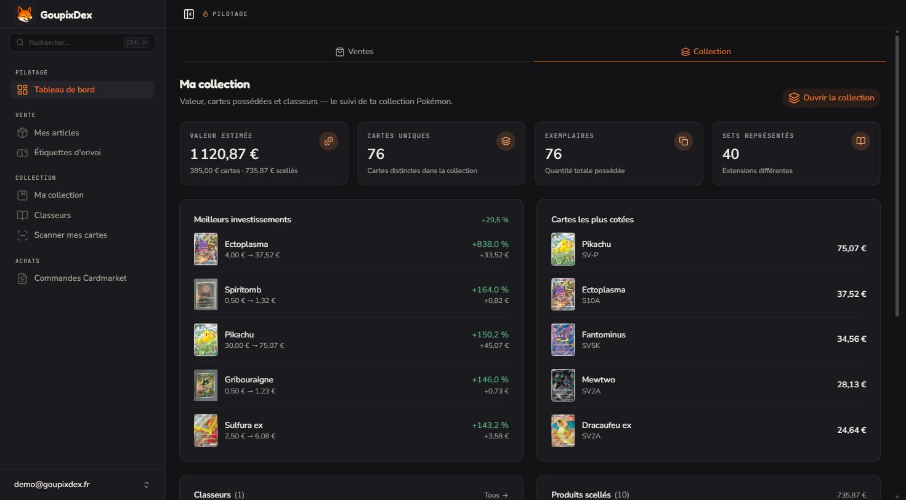</td>
  </tr>
  <tr>
    <td align="center"><b>Sales</b></td>
    <td align="center"><b>Collection</b></td>
  </tr>
</table>

### Selling on Vinted, eBay and Leboncoin

- **Listings** — every card for sale with its purchase and sale price and the marketplaces it is live on. Create one listing, a batch, or start from the catalog.
- **Listing drawer** — publish or withdraw on each marketplace in one click, compare Cardmarket, TCGPlayer and eBay prices, and see the Cardmarket order the card came from.
- **Vinted wardrobe sync** — imports your active listings, sold items and descriptions so the dashboard, stock and margins match your real activity.
- **Shipping labels** — prints Avery L7173 label sheets (recipient, sender, stamp) for pending eBay orders, plus manual labels.
- **Marketplace settings** — enable your channels, link Vinted (encrypted credentials, used by the local worker only) and connect eBay through OAuth; business policies and the shipping location are created for you.
- **eBay market** — price research on active listings and recently completed sales on eBay France.

<table>
  <tr>
    <td width="50%">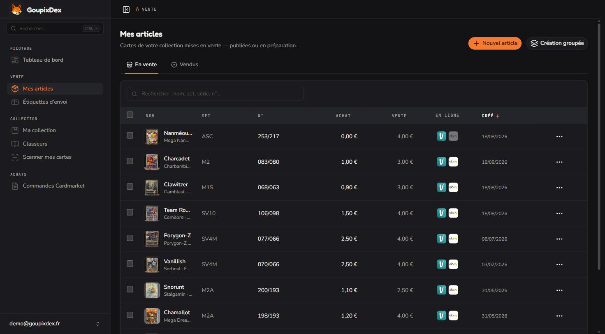</td>
    <td width="50%">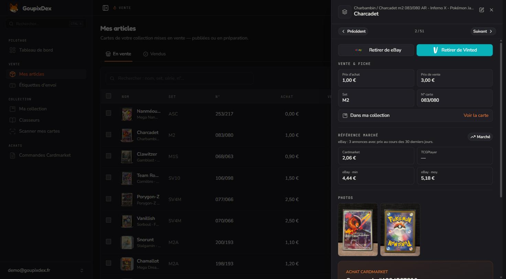</td>
  </tr>
  <tr>
    <td align="center"><b>Listings</b></td>
    <td align="center"><b>Listing drawer</b></td>
  </tr>
  <tr>
    <td width="50%">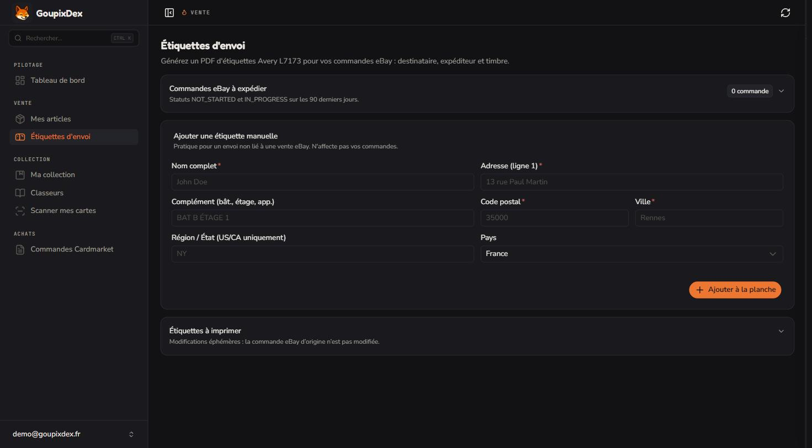</td>
    <td width="50%">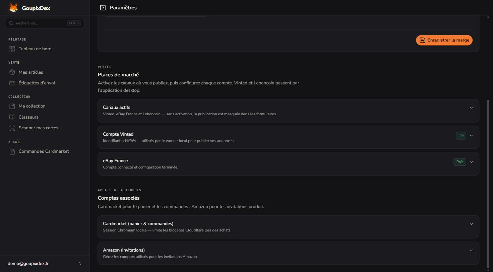</td>
  </tr>
  <tr>
    <td align="center"><b>Shipping labels</b></td>
    <td align="center"><b>Marketplace settings</b></td>
  </tr>
</table>

### Collection

- **My collection** — every card you own with its language, Cardmarket price and a badge when it is listed; KPIs for estimated value, capital gain, cards, sets and listed cards.
- **Sealed products** — Elite Trainer Boxes, Ultra-Premium Collections, boxes, displays… valued at the Cardmarket price, with the gain on your purchase price.
- **Value over time** — market value against purchase value, and the cards / sealed products split.
- **Binders** — themed sub-collections displayed like a real binder (3×3 pockets, custom cover) or as a grid, with missing cards in grayscale. Example below: the full 151 Kanto Pokédex.
- **Catalog** — browse every set from [TCGdex](https://tcgdex.dev/) (French, English, Japanese…) and add cards in one click.
- **Scanner** — your phone becomes a scanner in "cash register" mode (in / out): each card is identified on-device and lands in the collection in real time.

<table>
  <tr>
    <td width="50%">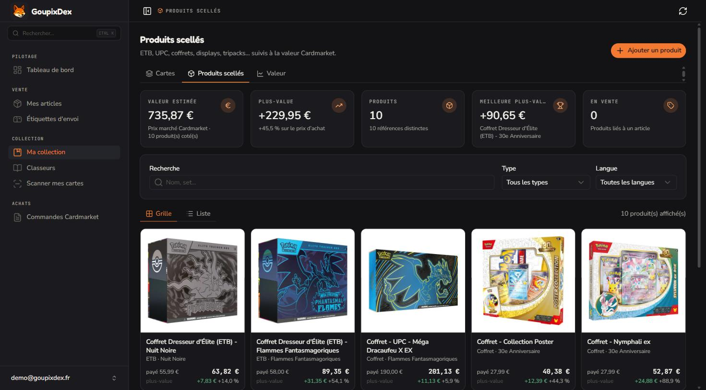</td>
    <td width="50%">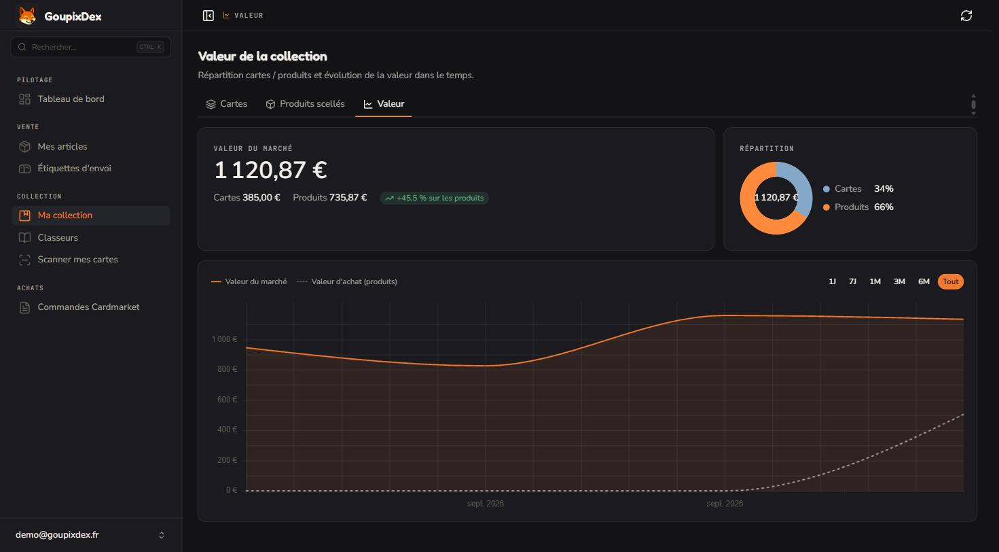</td>
  </tr>
  <tr>
    <td align="center"><b>Sealed products</b></td>
    <td align="center"><b>Value over time</b></td>
  </tr>
  <tr>
    <td width="50%">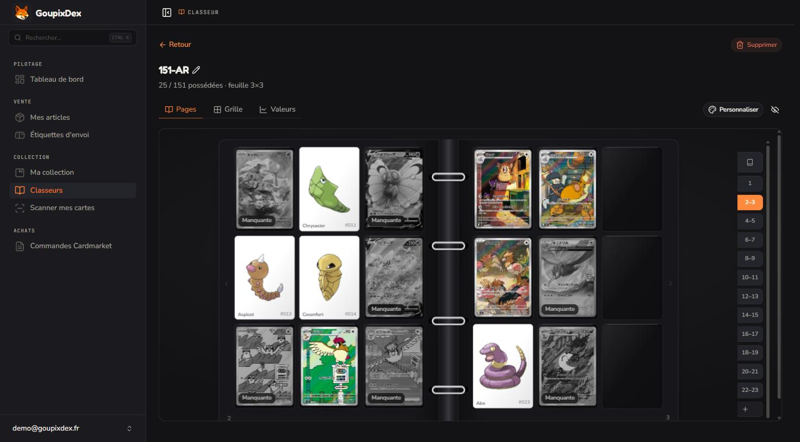</td>
    <td width="50%">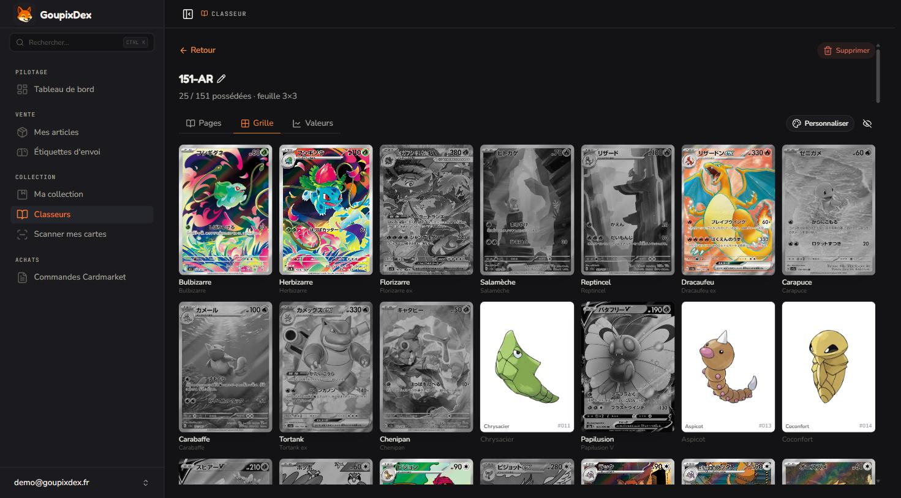</td>
  </tr>
  <tr>
    <td align="center"><b>Binder — pages</b></td>
    <td align="center"><b>Binder — grid</b></td>
  </tr>
  <tr>
    <td width="50%">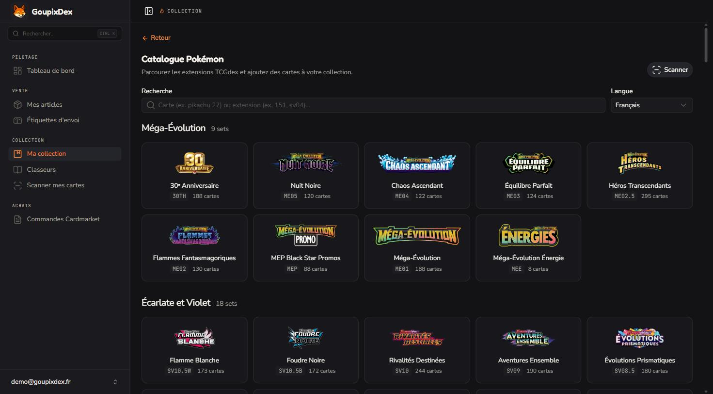</td>
    <td width="50%">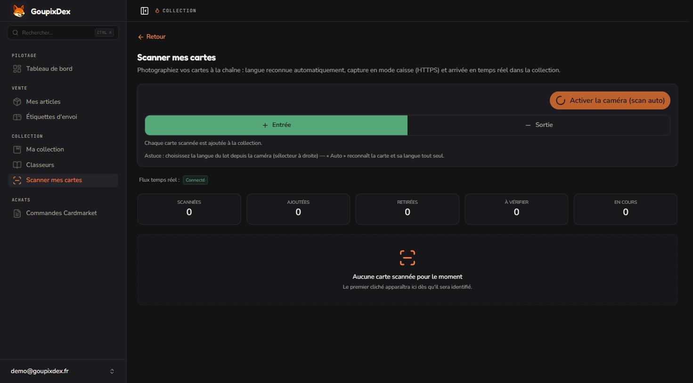</td>
  </tr>
  <tr>
    <td align="center"><b>Catalog</b></td>
    <td align="center"><b>Scanner</b></td>
  </tr>
</table>

### Purchases

- **Cardmarket orders** — import your purchase invoices (PDF) or sync them from the desktop app. Each card keeps its purchase cost, so the margin is exact when it sells, and every order shows how many of its cards are already sold.
- **Cart optimizer** *(desktop)* — paste links to the singles you want; GoupixDex ranks Cardmarket sellers by coverage and extra cost to cut shipping fees.
- **Amazon invites** *(desktop)* — manages invitation requests for invite-only Amazon products across your Amazon accounts.

  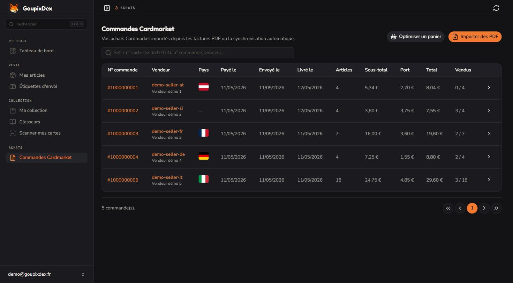

### Desktop app and landing page

The desktop app (Windows and macOS installers, published automatically by CI) carries the same interface as the web app, plus everything that needs to drive a browser on your machine: Vinted, Leboncoin, Cardmarket and Amazon.

<table>
  <tr>
    <td width="50%">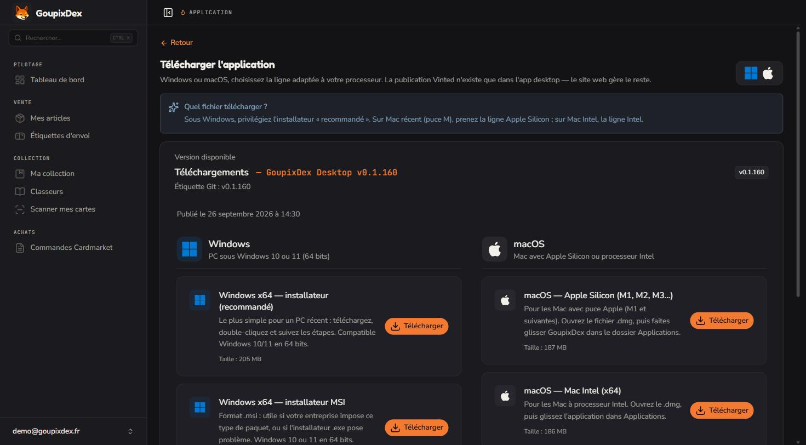</td>
    <td width="50%">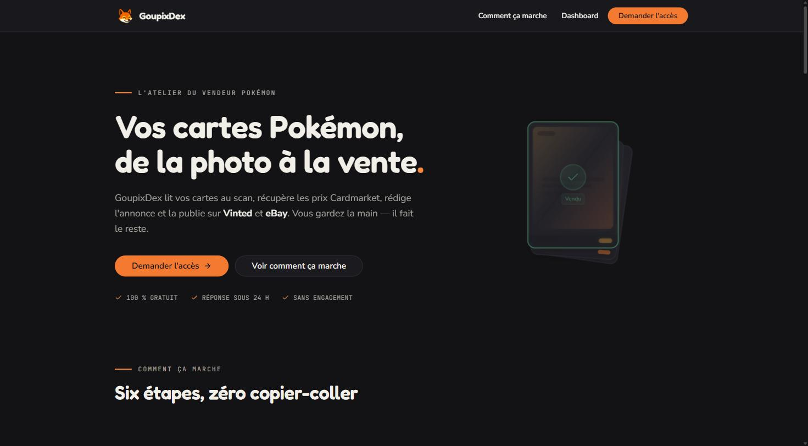</td>
  </tr>
  <tr>
    <td align="center"><b>Desktop downloads</b></td>
    <td align="center"><b>Landing page</b></td>
  </tr>
</table>

## How it works

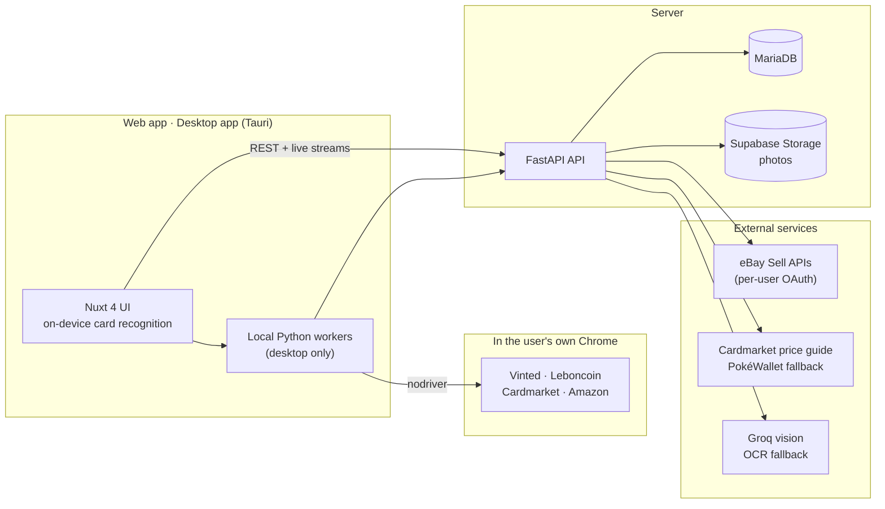

- **Browser automation runs on the user's machine.** Vinted, Leboncoin and Cardmarket block datacenter IPs and headless browsers, so the desktop app ships local Python workers (PyInstaller sidecars started by Tauri) that drive the user's own Chrome — Edge as a fallback — with [nodriver](https://github.com/ultrafunkamsterdam/nodriver). The web app covers everything else.
- **On-device card recognition.** The scanner detects the card and computes an image embedding in the browser (ONNX Runtime Web, in web workers), then matches it against a prebuilt card index shipped with the app. The server-side OCR (Groq vision) is only a fallback.
- **Pricing without an API key.** [`cardmarket-api`](cardmarket-api/) downloads Cardmarket's public nightly price guide, indexes it in memory and picks a sales-based reference (trend, then 7- and 30-day averages — never the single cheapest listing). [PokéWallet](https://api.pokewallet.io) is the fallback and brings TCGPlayer prices.
- **Secrets stay encrypted.** Vinted credentials and eBay tokens are encrypted at rest (Fernet); eBay uses per-user OAuth.
- **CI/CD.** GitHub Actions deploy the web app and the API to a VPS, build the desktop installers as GitHub releases and refresh the static catalog index every day.

## Tech stack

| Layer | Technologies |
|-------|--------------|
| Frontend | Nuxt 4, Vue 3, Nuxt UI 4, TypeScript, ONNX Runtime Web |
| Desktop | Tauri 2 (Windows + macOS), PyInstaller workers, nodriver (Chrome / Edge) |
| Backend | FastAPI, SQLAlchemy 2, MariaDB / MySQL, JWT, Fernet, custom SQL migrations |
| Integrations | eBay Sell APIs (Inventory + Account), Cardmarket price guide, TCGdex, PokéWallet, Groq vision, Supabase Storage |
| CI/CD | GitHub Actions — VPS deploys (web + API), desktop releases, daily catalog refresh |

## Repository layout

| Path | Description |
|------|-------------|
| [`web/`](web/) | Nuxt 4 frontend + Tauri desktop shell — see the [**Web README**](web/README.md) |
| [`api/`](api/) | FastAPI backend and the desktop workers (Vinted, Leboncoin, Cardmarket, Amazon) — see the [**API README**](api/README.md) and the [**eBay setup**](api/EBAY.md) |
| [`cardmarket-api/`](cardmarket-api/) | Standalone Python package: local Cardmarket pricing from the public price guide |
| [`cardmarket-rentable-seller/`](cardmarket-rentable-seller/) | Prototype script behind the cart optimizer (aggregates Cardmarket sellers across a list of singles) |
| [`o2switch-proxy/`](o2switch-proxy/) | Optional HTTP proxy for PokéWallet when the API host is blocked by upstream network rules |
| [`docs/screenshots/`](docs/screenshots/) | Screenshots used in this README |

## Getting started

Setup, environment variables and run commands live in the dedicated guides:

- **[`web/README.md`](web/README.md)** — install, `npm run dev`, build, Tauri desktop
- **[`api/README.md`](api/README.md)** — Python venv, migrations, `uvicorn`, Docker, API endpoints
- **[`api/EBAY.md`](api/EBAY.md)** — eBay developer keys, RuName, OAuth and onboarding

---

  Built by <a href="https://dibodev.fr">Léo Guillaume — Dibodev</a>. Personal project: the production URL and integrations may change.

